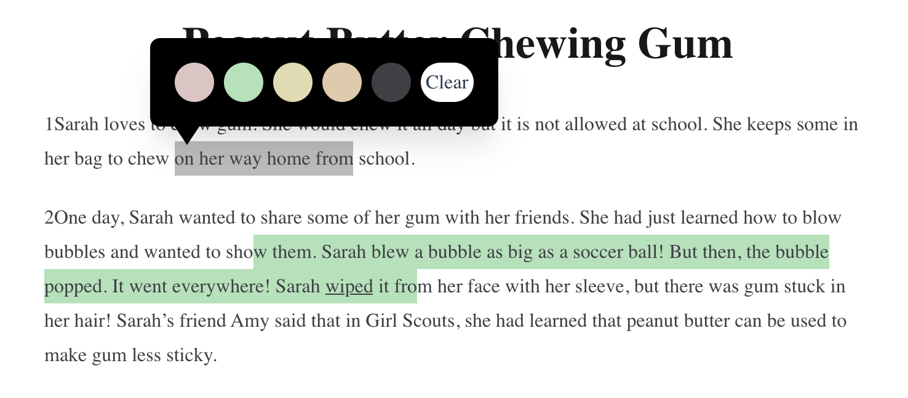
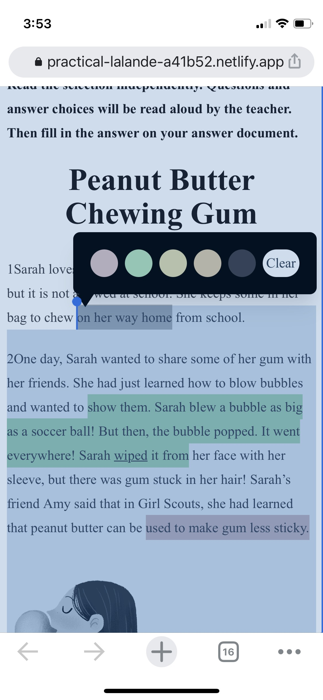
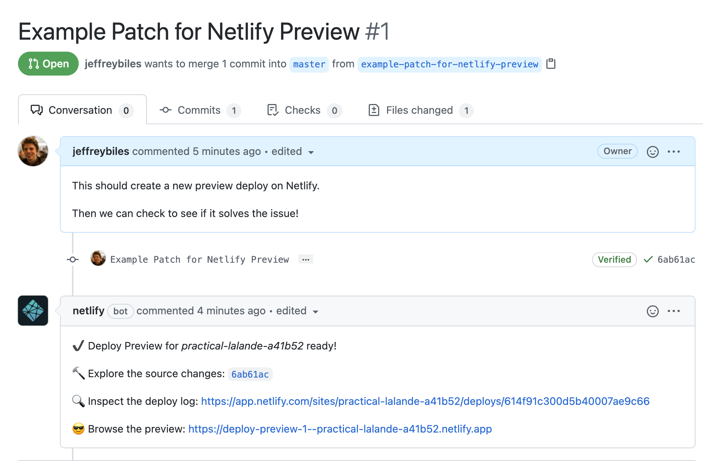

# Instructions for Bug Bounty

If you're the right person, with the right knowledge, this could take you an hour.  Or maybe even 10 minutes.  

The $500 payment is the same no matter how short or how long it takes you.

## The Problem

I'm building an app that lets people select and then highlight text.

This is what it looks like on desktop:

However, this is what it looks like on iOS: 

There are two issues on the display of the iOS selection, which are likely connected:
1. The light blue tint that's behind the entire screen
2. The dark blue showing that more is selected than should be

We want the iOS selection to consistently look like the desktop selection.

I created [a live version of the site](https://practical-lalande-a41b52.netlify.app/) where you can replicate the issue yourself.

## The Reward

To solve both the issues is $500.  If you only solve one, then you'll get $250.  The bounties go to the first person who solves them and submits a PR with the solution.

If you contribute publicly in a way that leads to solving the issue, I have a secondary $100 bounty for you (max 5 of these secondary bounties).  The secondary bounties are given at my discretion - most likely recipients are people who suggest solutions that are then used, or who submit not-quite-correct PRs that the winning PR builds off of.

## How to submit your solution and get paid

The solution should be submitted via a Github PR.

That will create a preview deploy, which I will use to test in iOS.  You can test it yourself as well.

Here's an example of what it looks like

This is also really useful to check to see if anyone else has solved the issue first - no need to do work if someone else has already claimed the bounty.

If you have a contribution, but not a working PR, please comment via GitHub Issues.  Usefulness is judged at my discretion.

Make sure to include your UpWork username with your PR or opened GitHub Issue, and apply to this job so I can find and pay you easier.

## Some more details that you may find useful

The relevant tech stack is the following:
- Vue 3 + Vue Router
- TailwindCSS

You'll be able to solve the issue without being an expert with any of them, but previous knowledge will help you understand the codebase quicker.

We're also using the following more obscure library, which is rather important to the proceedings:
- TextHighlighter: https://github.com/funktechno/texthighlighter

The most important parts of the code are in:
- https://github.com/jeffreybiles/highlighter-bug-example/blob/master/src/composables/text-highlighter.js (specifically `showHighlightPopup`)
- https://github.com/jeffreybiles/highlighter-bug-example/blob/master/src/components/HighlightSelectPopup.vue  (specifically the path to calling `showHighlightPopup`)

## Conclusion

Thanks for looking at this.  I wish you luck and a swift solution.  

No need to apply before you have a solution, and if you are the first to submit a good solution then the bounty is 100% yours - no other application process needed.

If you have any questions, message me on Upwork.
